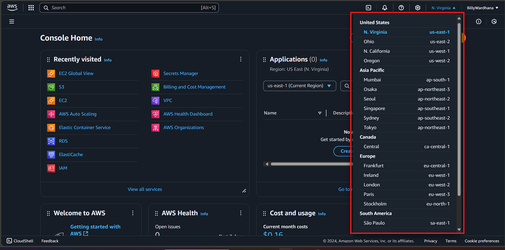
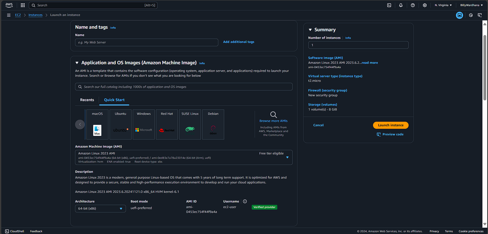
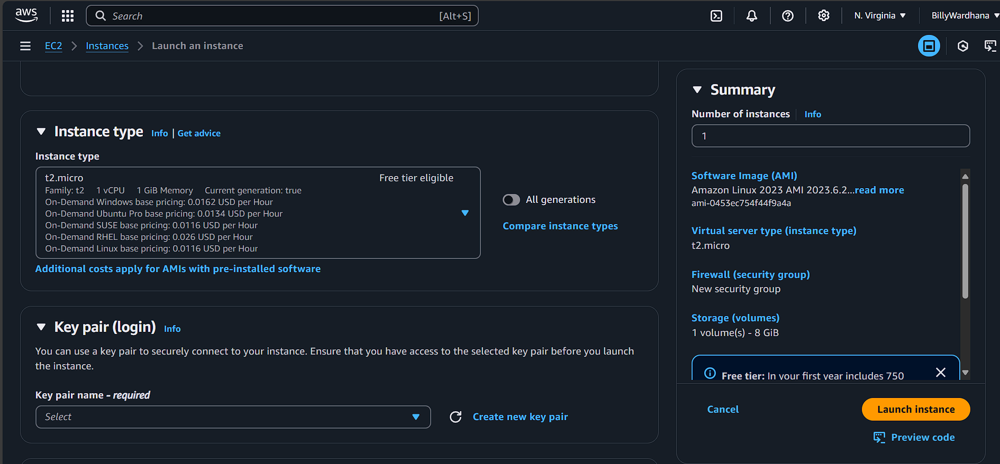
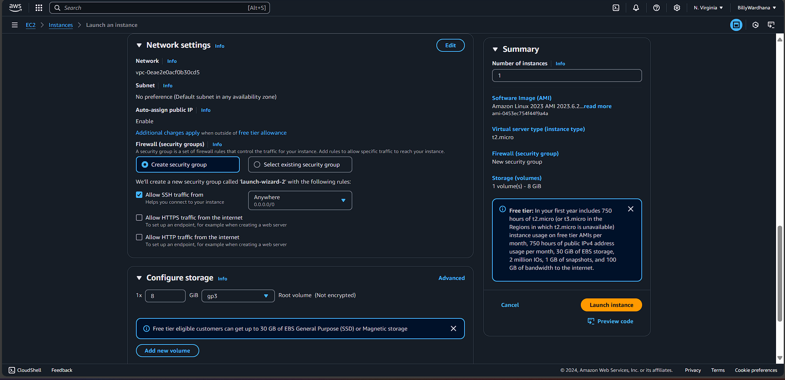
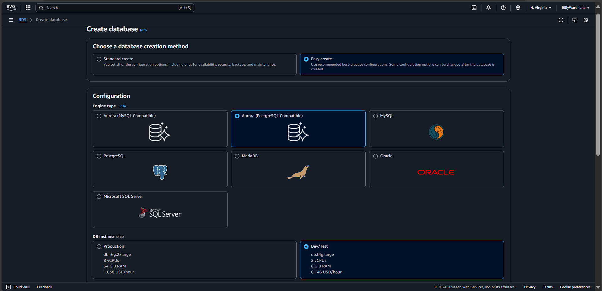
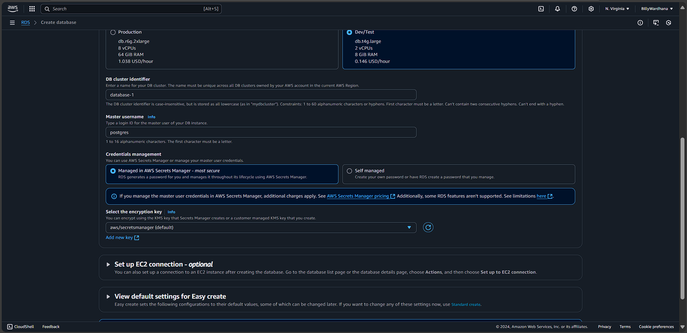
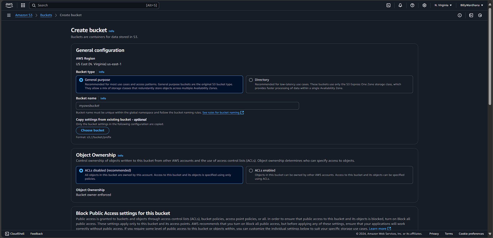
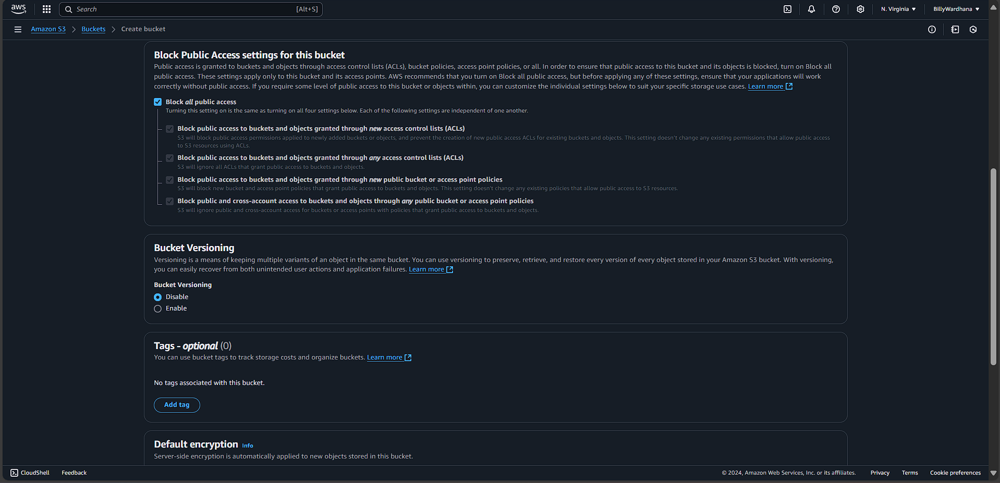
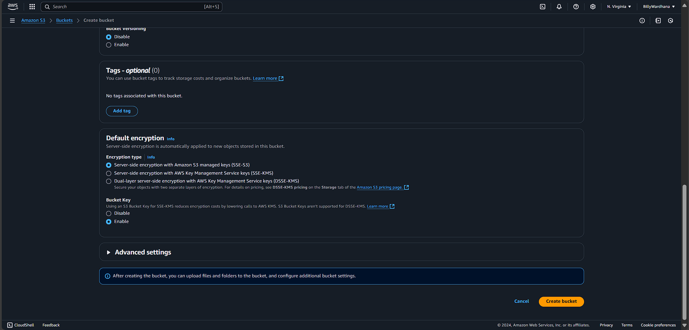

# AWS-Summary

AWS is a cloud platform that provides various tools and services to build and manage applications without needing to own or manage physical hardware. You pay only for what you use, and can scale them up or down.

In my experience, I used AWS to create IT solutions for hosting websites, store files, and run databases for my application.

# AWS Cloud Components

AWS allows you to create and manage Virtual Private Clouds (VPCs). VPCs can be created in all AWS-supported regions globally, allowing you to set up your cloud infrastructure with full control over networking, security, and resource placement.

*vpc regions that are available for free aws accounts*

For my application, I used 3 components of the AWS cloud infrastructure: **Amazon EC2** (Elastic Compute Cloud) for a virtual web server, **Amazon RDS** (Relational Database Service) for database management, and **Amazon S3** (Simple Storage Service) for object storage.

### Amazon EC2

EC2 is a service that provides **virtual computing resources** in the cloud. For my application, I used an EC2 instance running a ubuntu OS to host an apache web server.

*launching an EC2 instance from AWS console:*

*AMI (Amazon Machine Image) options to choose the machine's os (can use custom AMI's)*

*Select instance type to determine hardware configuration/computational capabilities*

*Key pair for secure connection into EC2 instance*

*Configure connection rulles through network settings*

### Amazon RDS

Amazon RDS provides a **managed database** in the cloud

*Create RDS instance options*

*Connect RDS with EC2 via security group configurations (EC2 Network settings)*

### Amazon S3

**Virtual storage** used for storing images for the web page

*create bucket configs*

